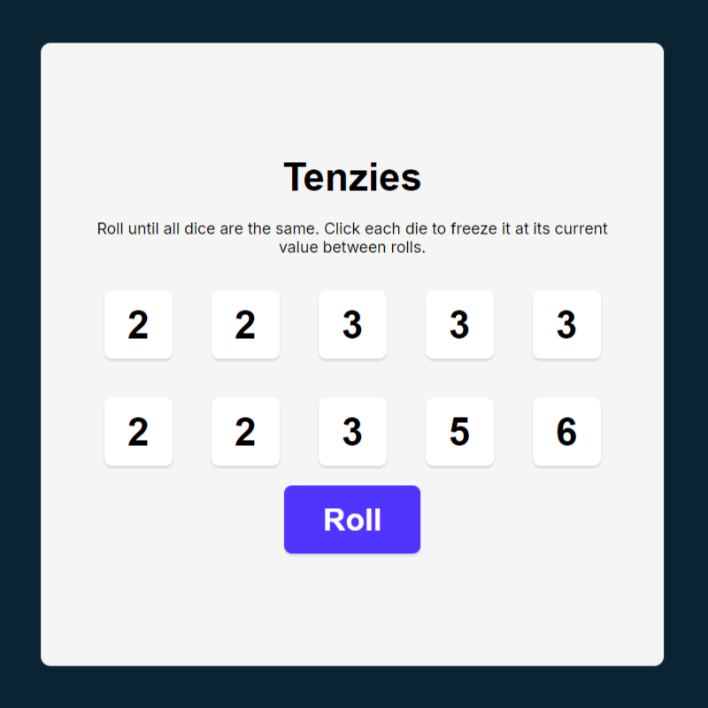
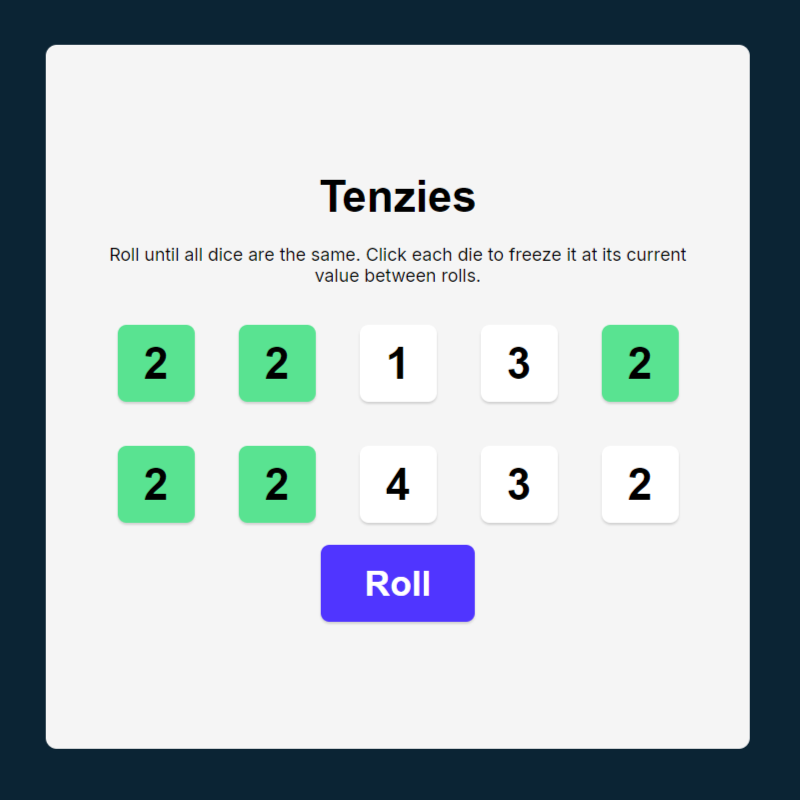
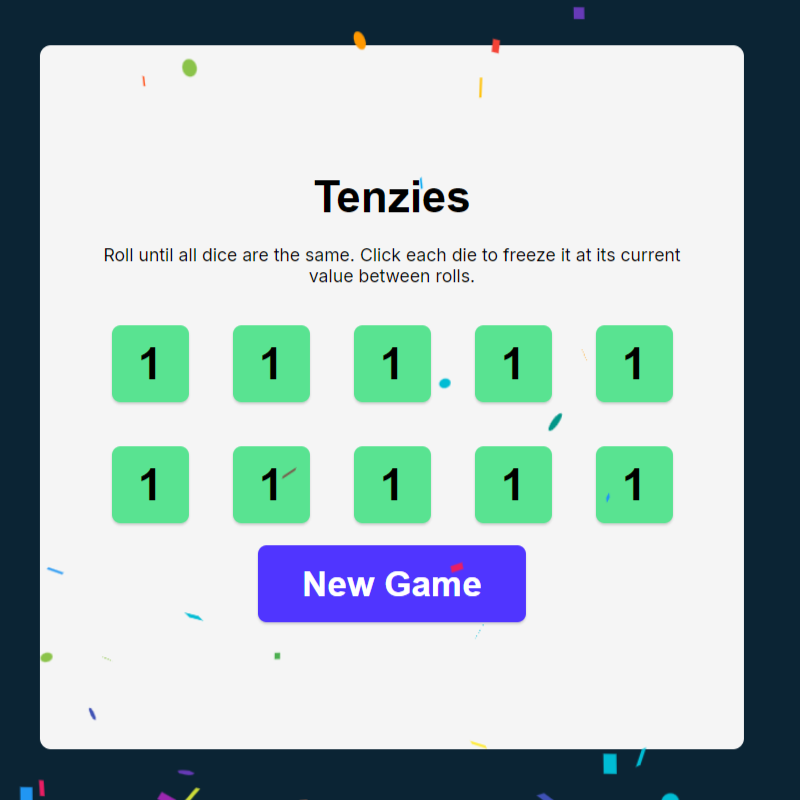

# Tenzies Game - React Project

This is a fun and interactive **Tenzies** game built using React. The project was created as part of a [Scrimba React course](https://scrimba.com/), designed to improve skills in React development by building engaging and practical projects.

## 🎲 Game Overview

Tenzies is a dice game where the goal is to roll until all dice show the same number. Players can freeze dice to retain their values between rolls. The game is complete when all dice have the same value and are frozen.

### Features

- Roll dice to randomize values.
- Freeze dice by clicking to keep their current value.
- Win the game when all dice have the same value and are frozen.
- Clean and responsive user interface.

---

## 🛠️ Technologies Used

- **React**: A JavaScript library for building user interfaces.
- **CSS**: For styling the application.
- **JavaScript**: The primary programming language.

---

## 🎮 How to Play

1. Click the **Roll Dice** button to randomize the dice values.
2. Click on individual dice to freeze their values.
3. Continue rolling until all dice have the same value.
4. Celebrate your win! 🎉

---

## 🌟 Key Learnings

Through this project, you'll gain experience with:

- **React hooks** like `useState` and `useEffect`.
- Managing state in a React application.
- Conditional rendering and event handling.
- Structuring React components.

---
### Game Interface

---
## 🖼️ Screenshots

---
## 🙌 Acknowledgments

Special thanks to the **Scrimba** team for their comprehensive and interactive React course!

---
